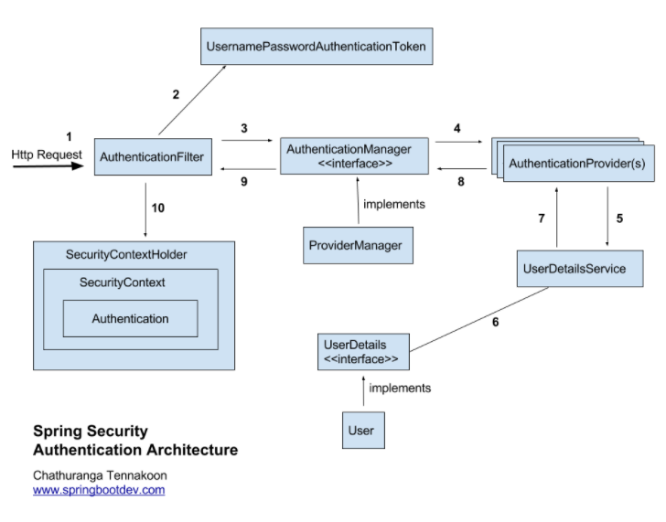

# Spring Security : Authentication Architecture

>https://springbootdev.com/2017/08/23/spring-security-authentication-architecture/
>
>위 링크의 내용을 개인적인 공부 목적으로 번역한 글입니다.




## 1. Received the HTTP Request

Spring security는 필터 체인을 가지고 있기 때문에 Request가 오면 해당 요청은 필터 체인(필터들)을 통과하며 Authentication(인증), Authorization(인가)을 확인하게된다.

User 인증 요청이 오면  인증 메커니즘/모델을 기반으로 상응하는 인증 필터를 찾을때까지 필터 체인을 통과한다.

```tex
E.g:
HTTP Basic authentication request goes through the chain of filters until it reaches the BasicAuthenticationFilter.
// HTTP 기본 인증 요청은 BasicAuthenticationFilter에 도달할 때 까지 필터 체인을 통과한다.

HTTP Digest authentication request goes through the chain of filters until it reaches the DigestAuthenticationFilter.
// HTTP Digest 인증 요청은 DigestAuthenticationFilter에 도달할 때 까지 필터 체인을 통과한다.

Login form submission request (login form authentication request)  goes through the chain of filters until it reaches the UsernamePasswordAuthenticationFilter.
// 로그인 인증의 경우 UsernamePasswordAuthenticationFilter에 도달할 때 까지 필터 체인을 통과한다.

x509 authentication request goes through the chain of filters until it reaches the X509AuthenticationFilter etc…
// x509 인증 요청의 경우 X509AuthenticationFilter에 도달할 때 까지 필터 체인을 통과한다.
```


<br><br>

## 2. Creates AuthenticationToken based on user credentials

인증 요청이 `AuthenticationFilter`에 도달하게 되면, 해당 요청에서 username과 password를 추출한다.(대부분의 인증 메커니즘은 username과 password를 요구한다.) 그 후 추출한 정보를 기반으로 인증 객체(Authentication object)를 생성한다.

username과 password를 기반으로 `UsernamePasswordAuthenticationToken`을 생성한다.


<br><br>

## 3. Delegating created AuthenticationToken for AuthenticationManager

`UsernamePasswordAuthenticationToken`을 생성한 후에,

해당 객체를 `AuthenticationManager`의 `authenticate()`를 통해 인증 과정을 수행한다.

```java
// AuathenticationManager.java
public interface AuthenticationManager {
  Authentication authenticate(Authentication authentication) throws AuthenticationException;
}
```

(`UsernamePasswordAuthenticationToken` 객체는 `Authentication` 인터페이스의 구현체.)

(더 상세히 말하면, `AbstractAuthenticationToken`이 `Authentication`의 구현체이며, 이를 상속받은 객체가 `UsernamePasswordAuthenticationToken` )


`ProviderManager`는 user 요청 인증에 대해 사용되는 `AuthenticationProvider` 리스트가 있으며, 

각각의 `AuthenticationProvider`를 살펴보고 전달된 인증 객체를 기반으로 사용자 인증을 시도한다.


<br><br>

## 4. Trying to authenticate with list of AuthenticationProvider(s)

`AuthenticationProvider`는 인증 객체를 기반으로 user 인증을 시도한다.

```java
public interface AuthenticationProvider {
    Authentication authenticate(Authentication authentication) throws AuthenticationException;
 
    boolean supports(Class<?> authentication);
}
```


<br><br>

## 5. UserDetailsService required?

몇몇의 `AuthenticationProvider`는 username을 기반으로 user 상세정보를 검색하기 위해 `UserDetailsService`를 사용한다. (예 `DaoAuthenticationProvider`)

```java
public interface UserDetailsService {
    UserDetails loadUserByUsername(String username) throws UsernameNotFoundException;
}
```


<br><br>

## 6 and 7. UserDetails or User Object?

`UserDetailsService`는 username을 기반으로 `UserDetails`를 검색한다


<br><br>

## 8. Authentication Object or AuthenticationException?

만약 user 인증이 성공한다면, 인증 객체가 가득 채워진 상태(아래 참고)로 반환이 되며

실패한다면, `AuthenticationException`이 발생한다


- 인증 객체가 가득 채워진 상태(Fully populated Authentication Object)
  - authenticated    -    true
  - grant authorities list
  - user credentials (username only)

어떤 `AuthenticationException`이 발생하게되면 해당 Exception은 `AuthenticationEntryPoint`에서 핸들링된다


<br><br>

## 9. Authentication is done!

인증이 완료되면, `AuthenticationManager`가 가득 채워진 인증 객체를 해당하는 `AuthenticationFilter`로 반환한다


<br><br>

## 10. Setting up Authentication Object in SecurityContext

`AuthenticationFilter`는 같은 유저를 또 인증하는 과정을 피하기 위해  `SecurityContext`에 해당 객체를 저장한다.

```java
SecurityContextHolder.getContext.setAuthentication(authentication);
```


